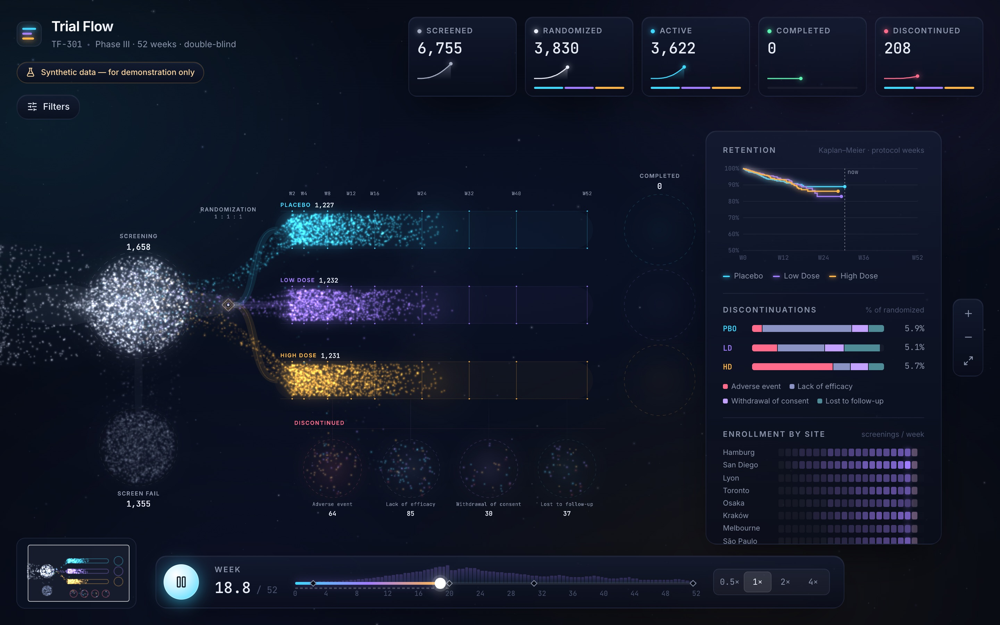
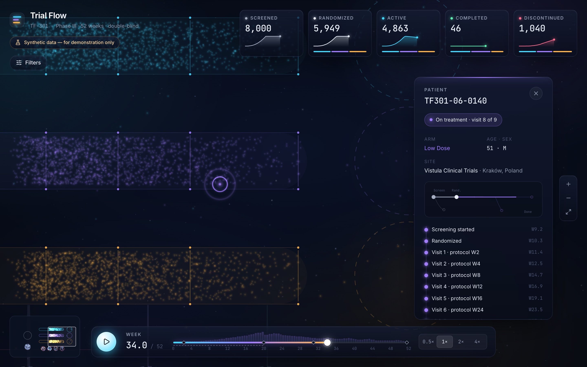
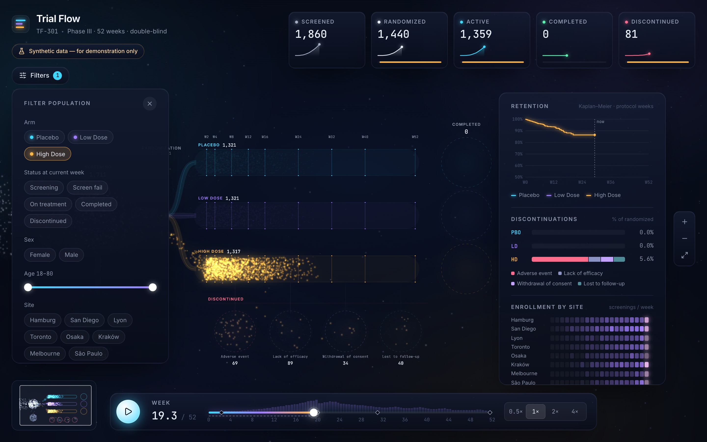
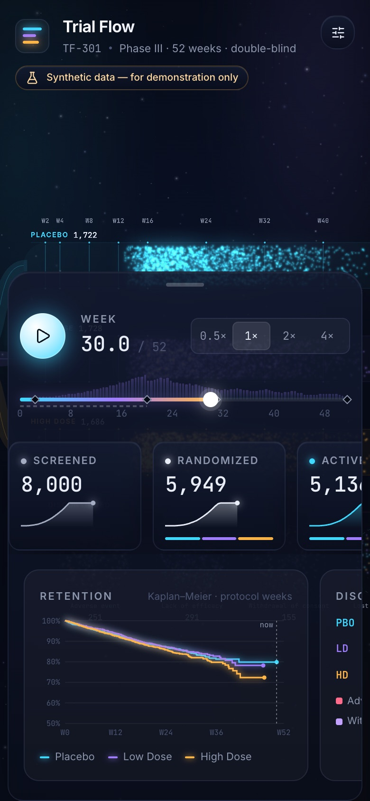

# Trial Flow



**Trial Flow** turns a 52-week, three-arm Phase III clinical trial into a living particle system. Thousands of synthetic patients stream into screening, branch at randomization into three glowing treatment lanes, tick past scheduled visits, and settle into *Completed* or one of four *Discontinued* pools. Scrub the timeline in either direction, filter the population, compare arms on live Kaplan–Meier curves, and click any particle to follow one patient's journey. It's built with React 19, PixiJS 8 and a pure, tested simulation core, and holds 60 fps with 15,000 particles.

**Live demo → https://lutsenkom.github.io/TrialFlow/**

> ⚗️ **Synthetic data — for demonstration only.** Every patient is generated in your browser from a fixed seed. There is no backend and no real patient data.

---

## Features

- **Particle scene (PixiJS 8):** 8k–15k patients as soft additive glow particles with bloom, motion trails, swarm drift and event bursts (randomization ripples, completion pulses, discontinuation sparks). Zones pulse when activity spikes.
- **Sankey flow ribbons** that thicken as patients pass along each path up to the current week.
- **Timeline:** play/pause, 0.5×–4× speed, a scrubber with a visit-density strip and study milestones. Clicks and arrow keys glide; dragging is 1:1; backwards works exactly like forwards.
- **Camera:** pan, zoom and pinch (pixi-viewport) with clamps, GSAP camera flights, and a minimap with a draggable viewport rectangle.
- **Click to inspect:** grid-accelerated hover and picking. The camera flies to the patient, a halo pulses, everyone else dims, and a card slides in with demographics, site, an animated event timeline and a mini journey map.
- **Filters:** arm, site, sex, age range and status-at-week. Matching particles brighten and others fade (cross-faded with GSAP), and every KPI, chart, counter and ribbon follows the filter.
- **Insights:** live KPI cards (count-up and sparklines), Kaplan–Meier retention per arm with a data cut at "now", discontinuation reasons per arm, and an enrollment heatmap (sites × weeks).
- **Cinematic intro:** a title reveal while the zones draw themselves in and the camera eases out, then autoplay. It can be skipped.
- **Responsive:** from 1440 px desktop down to a 390 px phone, where the UI becomes a draggable bottom sheet with swipeable chart cards.
- **Accessible:** labelled controls, visible focus, keyboard shortcuts, and full `prefers-reduced-motion` support.
- **Performance guard:** High/Medium/Low quality with automatic degrade below 50 fps, and an FPS overlay on **F**.

| Patient card | Filters | Phone |
| --- | --- | --- |
|  |  |  |

### Keyboard

| Key | Action |
| --- | --- |
| `Space` | Play / pause |
| `←` / `→` (`Shift` = 4) | Step a week |
| `+` / `-` / `0` | Zoom in / out / reset view |
| `Esc` | Close patient card |
| `F` | Performance overlay (FPS, quality, 8k/15k population) |

Deep links: `?week=30`, `?select=1200`, `?n=15000`, `?quality=low`, `?nointro`, `?stats`.

---

## Architecture

```
src/
  data/     seeded PRNG, study config, generator, getPatientStateAt   (pure, tested)
  core/     particle model, layout, flow stats, KM/insights, filters,
            spatial grid, perf monitor                                (pure, tested)
  store/    zustand store — the single source of truth
  scene/    imperative Pixi scene: layers, camera, trails, bursts, minimap
  ui/       React UI chrome: timeline, filters, KPIs, charts, patient card
  workers/  data generation Web Worker
```

**React owns the chrome, Pixi owns the canvas, and Zustand sits between them.**

- The store holds the shared state: `week`, `playing`, `speed`, `filters`, `selectedId`, `hoveredId`, `quality`.
- `TrialScene` is a plain TypeScript class, mounted once from `@pixi/react`'s `<Application>`. It reads the store with `getState()` in the Pixi ticker and reacts to changes through `subscribe()`. The **playback clock lives in the ticker**: it advances `week` every frame and writes it back to the store.
- **Particles bypass React entirely.** 15,000 components re-rendering 60 times a second is impossible. Instead, every frame `core/particleModel` writes positions, colours and alphas into **reused typed arrays**, and those are copied straight into one batched Pixi `ParticleContainer`. React never re-renders per frame.
- UI that has to move every frame (the playhead, the week readout) subscribes imperatively and writes to the DOM. Charts and KPIs read a **coarse week** that updates about 2–3 times per second at any speed.
- Positions are a **pure function of the week**: `computeParticle(patient, week)`. That one decision is what makes several features simple:
  - scrubbing backwards is free;
  - motion trails are just the same particle evaluated slightly in the past;
  - the incremental update can be checked bit-for-bit against a full recompute in tests.

## Synthetic data

`src/data/studyConfig.ts` defines **TF-301**: a Phase III, 52-week, double-blind study with Placebo / Low Dose / High Dose arms randomized 1:1:1, and 8 fictional sites in 8 countries.

- **Deterministic:** a `mulberry32` PRNG seeded with `301`. There's no `Math.random` in data code.
- **Enrollment:** about 8,000 screened (configurable up to 15,000). Each site has an activation week and a capacity weight, and the screening rate ramps up over weeks 0–20. Screening takes 1–3 weeks, and about 25% of patients fail it.
- **Randomization:** permuted blocks of 6 per site, in order of randomization date.
- **Visits:** at protocol weeks 2, 4, 8, 12, 16, 24, 32, 40 and 52.
- **Dropout:** constant weekly competing-risk hazards per arm and reason. High Dose drops out more for adverse events; Placebo more for lack of efficacy. The other two reasons are withdrawal of consent and lost to follow-up.
- **Timeline compression:** the treatment period is drawn at 0.55 calendar weeks per protocol week, so a 52-week protocol fits the 0–52 week axis even for late enrollers. KM curves and visit labels use protocol weeks. See `DECISIONS.md` for this and the other judgement calls.

`getPatientStateAt(patient, week)` returns the stage, the progress within it, the last visit and the dropout reason. Unit tests cover determinism, rates within tolerance, chronological events, 1:1:1 balance and state at week. They also check that the particle model and the insight maths agree with `getPatientStateAt`.

## Performance

Measured in headless Chromium on real GPU (ANGLE/Metal, Apple M1 Pro), production build, 15,000 particles:

- **60 fps at High** at 1× and 4× playback. Scene CPU time is about 1.5 ms per frame, and the worst frame is 16.8 ms.
- **With 4× CPU throttling** (a mid-range laptop proxy): 49–52 fps at High and ~59 fps at Low. Auto-degrade steps down within about 6 s.
- **What made the difference:**
  - writing the packed particle colour directly;
  - a static vertex buffer that's re-uploaded only on scale changes;
  - an incremental particle model that skips settled particles;
  - a sine lookup table for drift;
  - React updates tied to real time instead of weeks;
  - Kaplan–Meier on typed arrays;
  - no per-frame allocations in the ticker.

The details, numbers before and after, and the benchmark method are in **[PERFORMANCE.md](PERFORMANCE.md)**. You can reproduce them with `npm run bench`.

## Run locally

```bash
npm install          # Node 22+; see DECISIONS.md if npm 10 crashes on install
npm run dev          # http://localhost:5173/TrialFlow/
```

| Script | |
| --- | --- |
| `npm run lint` | ESLint + Prettier check |
| `npm run test` | Vitest unit tests |
| `npm run build` | Type-check and production build |
| `npm run smoke -- <url>` | Playwright runtime check of the main flow (needs `vite preview`) |
| `npm run screenshot -- <url> [dir] [ms]` | Desktop + mobile screenshots, fails on console errors |
| `npm run bench -- <url> 15000 high 1 4` | FPS benchmark (patients, quality, speed, CPU throttle) |

CI (`.github/workflows/ci.yml`) runs lint, tests and the build on every push, and deploys `main` to GitHub Pages.

## Tech

Vite · React 19 · TypeScript (strict) · PixiJS 8 + @pixi/react · pixi-viewport · pixi-filters · GSAP · Zustand · Motion · lucide-react · Vitest · Playwright · ESLint + Prettier.

---

*Synthetic data — for demonstration only. TF-301, its sites and its patients are fictional.*
